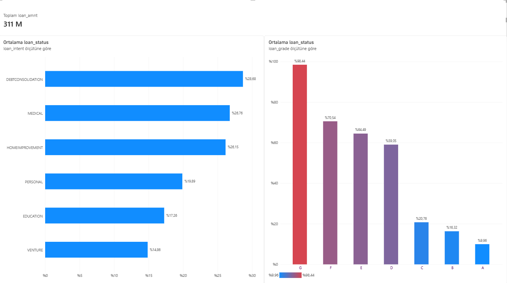

# 🏦 Kredi Risk Analizi & Uçtan Uca Veri Analitiği Projesi
# 🏦 Credit Risk Analysis & End-to-End Data Analytics Portfolio Project

---

## 🇹🇷 Türkçe / Turkish

### 📌 Proje Hakkında
Bu proje; finans sektöründe hayati önem taşıyan **Kredi Risk Analizi (Credit Risk Analysis)** problemini, ham veriden kurumsal düzeyde bir iş zekası panosuna kadar uçtan uca (`end-to-end`) ele alan profesyonel bir veri analitiği çalışmasıdır.

### 📂 Veri Kaynağı (Dataset)
Projede kullanılan ham veri seti **Kgle (Kaggle)** üzerinden temin edilmiş olup, eksik değerlerin giderilmesi ve anomali tespiti aşamalarından geçirilerek analize hazır hale getirilmiştir.

### 🚀 Proje Mimarisi ve Kullanılan Teknolojiler
* **Python (`cleaning_py`):** Veri ön işleme, eksik değer analizi ve veri temizleme operasyonları.
* **SQL Server (`risk_segmentation.sql`):** İlişkisel veritabanı yönetimi ve risk segmentasyonu için yazılan analitik sorgular.
* **Power BI:** Çok sayfalı kurumsal gösterge paneli, koşullu biçimlendirme ve finansal KPI kartları.

### 📊 Öne Çıkan Analitik Bulgular
1. **Kredi Sınıfları ve Batık Oranı (`loan_grade`):** Riskin A sınıfından G sınıfına doğru üstel olarak arttığı kanıtlanmıştır. Özellikle **G sınıfı kredilerde batık oranının %98.44 seviyesine ulaştığı** tespit edilmiştir.
2. **Kredi Amacı Dağılımı (`loan_intent`):** Müşterilerin en çok **Borç Kapatma (Debt Consolidation)** ve **Sağlık (Medical)** amaçlı kredilere yöneldiği gözlemlenmiştir.
3. **Portföy Genel Görünümü:** Bankanın toplam kredi hacmi **311 Milyon** olarak raporlanmıştır.

---

##  English

### 📌 About the Project
This project is an end-to-end data analytics study addressing the critical banking sector problem of **Credit Risk Analysis**, transforming raw data into an enterprise-grade business intelligence dashboard.

### 📂 Dataset Source
The raw dataset used in this project was obtained from **Kaggle** and underwent rigorous data cleaning and preprocessing phases to ensure analytical reliability.

### 🚀 Architecture & Technologies Used
* **Python (`cleaning_py`):** Data preprocessing, handling missing values, and data cleaning scripts.
* **SQL Server (`risk_segmentation.sql`):** Relational database management and analytical queries for risk segmentation.
* **Power BI:** Multi-page corporate dashboard,  conditional formatting, and financial KPI cards.

### 📊 Key Analytical Findings
1. **Loan Grades & Default Rates (`loan_grade`):** Risk increases exponentially from Grade A to Grade G. Notably, the default rate for **Grade G loans reaches 98.44%**.
2. **Loan Intent Distribution (`loan_intent`):** Customers predominantly apply for **Debt Consolidation** and **Medical** purposes.
3. **Portfolio Overview:** Total loan portfolio volume is reported at **311 Million**.

---

## 🗂️ Repository Yapısı / File Structure
* `credit_risk_dataset.csv`: Orijinal ham veri seti (Kaggle) / Original raw dataset.
* `temizlenmis_kredi_verisi.csv`: İşlenmiş ve analize hazır veri seti / Cleaned dataset.
* `cleaning_py`: Python veri temizleme betikleri / Python cleaning scripts.
* `risk_segmentation.sql`: SQL risk segmentasyon sorguları / SQL risk segmentation queries.
* `dashboard_preview.png`: Power BI gösterge paneli önizlemesi / Power BI dashboard preview.
